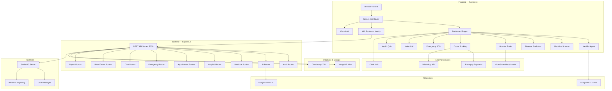

# 🏥 AROGYA RAKSHA — Smart Healthcare Platform

## Complete Project Documentation & Presentation Guide

---

# 📋 TABLE OF CONTENTS

1. [Project Overview](#1-project-overview)
2. [Problem Statement](#2-problem-statement)
3. [Proposed Solution](#3-proposed-solution)
4. [Technology Stack](#4-technology-stack)
5. [System Architecture](#5-system-architecture)
6. [Module-wise Description](#6-module-wise-description)
7. [Database Schema](#7-database-schema)
8. [API Documentation](#8-api-documentation)
9. [AI Agents & Intelligence](#9-ai-agents--intelligence)
10. [Datasets Used](#10-datasets-used)
11. [Key Features Summary](#11-key-features-summary)
12. [Security & Middleware](#12-security--middleware)
13. [Folder Structure](#13-folder-structure)
14. [Screenshots / Pages](#14-screenshots--pages)
15. [Future Scope](#15-future-scope)
16. [Conclusion](#16-conclusion)
17. [Presentation Slides Script](#17-presentation-slides-script)

---

# 1. PROJECT OVERVIEW

| Field | Details |
|---|---|
| **Project Name** | Arogya Raksha — Smart Healthcare Platform |
| **Tagline** | AI-powered healthcare platform with diagnostics, telemedicine, and medicine intelligence |
| **Type** | Full-Stack Web Application |
| **Domain** | Healthcare / HealthTech / AI in Medicine |
| **Frontend** | Next.js 16 (React 19) + TailwindCSS 4 |
| **Backend** | Express.js (Node.js) |
| **Database** | MongoDB (Mongoose ODM) |
| **AI Engine** | Google Gemini AI + Groq LLM |
| **Authentication** | Clerk (Frontend) + JWT (Backend) |
| **Real-time** | Socket.IO (Chat + Video Call Signaling) |
| **Payments** | Razorpay (UPI, Cards, Net Banking, Wallets) |
| **Maps** | Leaflet.js + OpenStreetMap |
| **Deployment Ready** | Yes — separate frontend & backend |

---

# 2. PROBLEM STATEMENT

India faces a critical healthcare accessibility gap:

- **70% of the population** lives in rural areas with limited hospital access
- **1 doctor per 1,445 patients** (WHO recommends 1:1000)
- Patients struggle to find **verified medicine information** in their local language
- **No centralized platform** combines AI diagnostics, medicine scanning, hospital discovery, and telemedicine
- Prescription misinterpretation and **self-medication** cause thousands of adverse drug events annually
- **Emergency response** in remote areas lacks real-time coordination

> **Arogya Raksha** addresses all of these challenges in a single, intelligent platform.

---

# 3. PROPOSED SOLUTION

Arogya Raksha is an **AI-first healthcare platform** that provides:

| Capability | How It Solves the Problem |
|---|---|
| 🤖 AI Symptom Checker | Patients describe symptoms → AI suggests possible conditions, medicines, and urgency level |
| 📸 Medicine Scanner | Scan any medicine packaging → get full details (uses, side effects, alternatives, price) |
| 🏥 Hospital Finder | Real-time GPS-based discovery of **58,000+ hospitals** across India |
| 💊 Medicine Database | **253,000+ medicines** with price, composition, manufacturer, and alternatives |
| 🩺 Disease Predictors | Bayesian-style risk prediction for **9 diseases** based on health data |
| 📞 Telemedicine | Video call + WhatsApp integration for doctor consultations |
| 🚨 Emergency SOS | One-tap emergency alert with ambulance dispatch and first aid |
| 🧠 Health Quiz | AI-generated health awareness quizzes to improve health literacy |
| 🗣️ Multilingual Support | Full support for **8 Indian languages** (English, Hindi, Telugu, Tamil, Kannada, Marathi, Bengali, Bhojpuri) |
| 💳 Online Payments | Razorpay-powered payments for consultations and medicine orders |

---

# 4. TECHNOLOGY STACK

## Frontend

| Technology | Version | Purpose |
|---|---|---|
| **Next.js** | 16.1.6 | React framework with SSR, API routes, file-based routing |
| **React** | 19.2.3 | UI library |
| **TypeScript** | 5.x | Type safety |
| **TailwindCSS** | 4.x | Utility-first CSS framework |
| **Clerk** | 7.0.4 | Authentication (sign-up, sign-in, user management) |
| **Groq SDK** | 1.1.1 | LLM API for MediBot chatbot |
| **Razorpay** | 2.9.6 | Payment gateway integration |
| **Leaflet** | 1.9.4 | Interactive maps |
| **React-Leaflet** | 5.0.0 | React bindings for Leaflet |
| **Recharts** | 3.8.0 | Data visualization charts |
| **Framer Motion** | 12.36.0 | Animations |
| **Lucide React** | 0.577.0 | Icon library |
| **Socket.IO Client** | 4.8.3 | Real-time communication |

## Backend

| Technology | Version | Purpose |
|---|---|---|
| **Express.js** | 5.2.1 | REST API framework |
| **Mongoose** | 9.3.0 | MongoDB ODM |
| **Socket.IO** | 4.8.3 | Real-time WebSocket server |
| **Google Generative AI** | 0.24.1 | Gemini AI for medical intelligence |
| **JWT** | 9.0.3 | Token-based authentication |
| **bcryptjs** | 3.0.3 | Password hashing |
| **Helmet** | 8.1.0 | HTTP security headers |
| **Express Rate Limit** | 8.3.1 | API rate limiting |
| **Cloudinary** | 2.9.0 | Image/file cloud storage |
| **Multer** | 2.1.1 | File upload handling |
| **Morgan** | 1.10.1 | HTTP request logging |

---

# 5. SYSTEM ARCHITECTURE



### Data Flow

```
User → Clerk Auth → Dashboard → Feature Module
     → Next.js API Route → Backend Express API → MongoDB / AI Service → Response
     → Socket.IO (for real-time chat/video)
```

---

# 6. MODULE-WISE DESCRIPTION

## 6.1 — Authentication Module
| Component | Technology |
|---|---|
| Frontend Auth | Clerk (OAuth, Email/Password) |
| Backend Auth | JWT + bcrypt |
| Middleware | Token verification + Role-based access (patient/doctor/admin) |

- User registration with role selection (Patient / Doctor)
- Doctor registration creates both User + Doctor profile (with license ID, specialization)
- Session management via 7-day JWT tokens
- Password hashing with bcrypt (cost factor: 12)

---

## 6.2 — Dashboard
The main dashboard provides a unified health overview:

- **Welcome Header** — Personalized greeting with user's first name
- **Medicine Scanner Card** — Quick access to AI-powered medicine scanning
- **Health Stats** — Heart rate, blood pressure, sugar level display
- **Prescription Reader** — Upload and analyze doctor prescriptions
- **Symptom Checker** — Enter symptoms with AI-powered suggestions
- **AI Diagnosis Suggestion** — Condition prediction based on symptoms
- **Medicine Information** — Quick medicine lookup
- **Nearby Hospitals** — GPS-powered hospital cards with ratings
- **Diagnostic Services** — Lab tests and diagnostic center finder
- **Testimonials** — User reviews and ratings carousel

---

## 6.3 — Medicine Scanner (AI-Powered)
**Path:** `/dashboard/scanner`

| Feature | Description |
|---|---|
| Image Upload | Drag & drop or camera capture |
| AI Analysis | Google Gemini vision API identifies medicine from image |
| Output | Medicine name, generic name, composition, uses, side effects, dosage, warnings, alternatives, price |
| Dataset Match | Cross-references against 253K+ medicine database |
| Order Button | Direct link to order the scanned medicine |

**Technical Flow:**
```
Image → Base64 encode → /api/scan-medicine → Gemini Vision API
     → Parse structured response → Display results
     → Cross-reference /api/medicines dataset → Show database matches
```

---

## 6.4 — Disease Predictors (Bayesian Risk Engine)
**Path:** `/dashboard/predictors`

Implements a **Bayesian-style risk scoring engine** that computes disease probability from health inputs.

### Supported Diseases (9 Predictors)

| # | Disease | Key Input Factors |
|---|---|---|
| 1 | **Diabetes & Heart Disease** | Age, BMI, Blood Pressure, Cholesterol, Glucose, Smoking |
| 2 | **Dengue** | Fever, Headache, Joint Pain, Bleeding (symptom combo) |
| 3 | **Kidney Disease** | Age, BP, Diabetes, Hypertension, Alcohol |
| 4 | **Liver Disease** | Age, Gender, BMI, Alcohol, Smoking |
| 5 | **Lung Disease** | Age, Smoking, Pollution, BMI |
| 6 | **Cancer** | Age, Gender, Smoking, Family History, Radiation |
| 7 | **Thyroid** | Age, Gender, TSH Level, Radiation Exposure |
| 8 | **Asthma** | Age, BMI, Allergies, Air Pollution, Smoking |
| 9 | **Mental Health** | Sleep, Stress, Social Media, Screen Time, Diet, Exercise, Social Activity |

### Algorithm
```
Base Rate → Log-Odds → Apply Likelihood Ratios per factor (damped ×0.5)
         → Convert back to probability → Clamp [1%, 95%]
         → Classify: Low / Moderate / High / Very High
         → Generate personalized advice
```

---

## 6.5 — Hospital Finder (GPS + 58K Database)
**Path:** `/dashboard/hospitals`

| Feature | Description |
|---|---|
| Database | 58,000+ hospitals across India |
| Geo Search | Haversine formula for distance calculation |
| Bounding Box | Pre-filter for performance on large dataset |
| Categories | Government, Private, ESI, Ayurveda hospitals |
| Map View | Interactive Leaflet/OpenStreetMap with markers |
| Stats | State-wise hospital distribution analytics |

**API:** `GET /api/hospitals?lat=28.6&lng=77.2&radius=10&limit=50`

---

## 6.6 — Doctor Consultation & Booking
**Path:** `/dashboard/doctors`

- **5 Specialist Doctors** with photos, ratings, experience, fees
- **Specializations:** General Surgeon, Dermatologist, Pediatrician, Cardiologist, Neurologist
- **Multi-step Booking Modal:**
  1. Select date (next 7 days) & time slot
  2. Enter patient details
  3. Confirmation sent via WhatsApp
- **Direct Actions:** Book Now, Video Call, WhatsApp Message, Phone Call
- **Razorpay Payment** integration for consultation fees

---

## 6.7 — MediBot AI Agent (Multilingual Chatbot)
**Component:** `MediBotAgent.jsx` — Floating chat panel on every dashboard page

| Feature | Description |
|---|---|
| AI Engine | Groq (Llama LLM) with function calling |
| Languages | 8 Indian languages (EN, HI, TE, TA, KN, MR, BN, BHO) |
| Voice Input | Web Speech API — speech-to-text in selected language |
| Voice Output | Text-to-speech for bot responses |
| Image Upload | Analyze medicine/report images via AI |
| Quick Actions | Book Appointment, Medicine Help, Nearby Hospitals, Health Quiz, Scan Medicine, Symptom Check |
| Navigation | AI can navigate user to different pages automatically |
| Booking Form | In-chat appointment booking with specialty selection |
| Quiz Engine | AI-generated health quizzes with scoring |

---

## 6.8 — Emergency SOS
**Path:** `/dashboard/emergency`

- **One-tap SOS** alert with GPS location
- Emergency contacts management
- **Default emergency numbers:** Ambulance (108), Emergency (112), Poison Control, Mental Health helpline
- Nearest hospital auto-detection
- First aid instructions from AI Emergency Agent

---

## 6.9 — Symptom Checker
**Path:** `/dashboard/symptoms`

- Input multiple symptoms with severity levels
- AI analyzes symptoms using Gemini Symptom Checker agent
- Returns: Possible conditions (ranked), Recommended medicines, Urgency level, Home remedies
- Always includes medical disclaimer

---

## 6.10 — Medicine Store & Ordering
**Path:** `/dashboard/medicines`

- Browse & search from **253,000+ medicines**
- Alphabetically sharded JSON files (A-Z) for performance
- Each medicine has: Name, manufacturer, price, composition, prescription requirement
- AI-powered medicine advisor for unknown medicines
- Razorpay checkout for online ordering

---

## 6.11 — Video Consultation
**Path:** `/dashboard/video-call`

- WebRTC-based peer-to-peer video calling
- Socket.IO for signaling (call, answer, end)
- Direct integration from doctor cards

---

## 6.12 — Health Quiz
**Path:** `/dashboard/quiz`

- AI-generated health quizzes
- Multiple topics and difficulty levels
- Score tracking with explanations
- Available in all supported languages

---

## 6.13 — Payments (Razorpay)
**Component:** `RazorpayCheckout.tsx`

| Payment Method | Supported |
|---|---|
| UPI (GPay, PhonePe, Paytm) | ✅ |
| Credit/Debit Cards | ✅ |
| Net Banking | ✅ |
| Wallets | ✅ |
| EMI | ✅ |
| Pay Later | ✅ |

**Flow:** Client → Create Order API → Razorpay Checkout → Payment → Server Verification → Confirmation

---

## 6.14 — Reports & Analytics
**Path:** `/dashboard/reports`

- Upload medical reports (blood tests, scans, lab reports, prescriptions)
- AI-powered report analysis:
  - Identifies test parameters and values
  - Flags abnormal values (high/low/critical)
  - Provides health summary and recommendations
  - Simple language explanations

---

## 6.15 — Real-time Chat
- Socket.IO powered real-time messaging
- Support for: Text, Image, Voice, Video, File, Prescription messages
- Typing indicators
- Online user tracking
- Chat history persistence in MongoDB

---

# 7. DATABASE SCHEMA

## MongoDB Collections

### 7.1 — Users
```javascript
{
  name: String (required),
  email: String (required, unique),
  password: String (required, bcrypt hashed),
  role: Enum ['patient', 'doctor', 'admin'],
  phone: String,
  avatar: String,
  healthProfile: {
    age: Number,
    weight: Number,
    height: Number,
    bloodGroup: Enum ['A+', 'A-', 'B+', 'B-', 'AB+', 'AB-', 'O+', 'O-'],
    allergies: [String],
    existingDiseases: [String],
    prescriptions: [String],
    emergencyContacts: [{ name, phone, relation }]
  },
  preferredLanguage: String (default: 'en'),
  location: { type: 'Point', coordinates: [Number] },  // 2dsphere index
  isActive: Boolean,
  timestamps: true
}
```

### 7.2 — Doctors
```javascript
{
  userId: ObjectId → User (required),
  licenseId: String (required, unique),
  specialization: String (required),
  qualification: String,
  experience: Number,
  hospital: ObjectId → Hospital,
  verified: Boolean,
  consultationFee: Number,
  rating: Number,
  totalReviews: Number,
  availability: [{
    day: Enum ['Monday'..'Sunday'],
    slots: [{ startTime, endTime, isBooked }]
  }],
  languages: [String],
  bio: String,
  timestamps: true
}
```

### 7.3 — Appointments
```javascript
{
  patient: ObjectId → User (required),
  doctor: ObjectId → Doctor (required),
  hospital: ObjectId → Hospital,
  date: Date (required),
  timeSlot: { startTime, endTime },
  department: String,
  reason: String,
  status: Enum ['pending', 'confirmed', 'cancelled', 'completed'],
  paymentStatus: Enum ['pending', 'uploaded', 'verified', 'failed'],
  paymentProof: String,
  notes: String,
  prescription: String,
  followUp: Date,
  timestamps: true
}
```

### 7.4 — Hospitals
```javascript
{
  name: String (required),
  address: String (required),
  city: String, state: String, pincode: String,
  phone: String, email: String, website: String,
  type: Enum ['government', 'private', 'clinic'],
  departments: [String],
  facilities: [String],
  emergency: Boolean,
  ambulance: Boolean,
  rating: Number,
  totalBeds: Number, availableBeds: Number,
  image: String,
  location: { type: 'Point', coordinates: [Number] },  // 2dsphere index
  timestamps: true
}
```

### 7.5 — Medicines
```javascript
{
  name: String (required, text index),
  genericName: String (text index),
  category: String (text index),
  usage: [String],
  dosage: String,
  sideEffects: [String],
  precautions: [String],
  contraindications: [String],
  marketPrice: Number,
  alternatives: [String],
  manufacturer: String,
  prescription_required: Boolean,
  description: String,
  timestamps: true
}
```

### 7.6 — Reports
```javascript
{
  user: ObjectId → User (required),
  type: Enum ['blood_test', 'scan', 'lab', 'prescription', 'other'],
  title: String,
  fileUrl: String,
  extractedText: String,
  analysis: {
    summary: String,
    abnormalValues: [{ parameter, value, normalRange, status: 'high'|'low'|'critical' }],
    recommendations: [String],
    overallStatus: Enum ['normal', 'attention', 'critical']
  },
  aiInsights: String,
  timestamps: true
}
```

### 7.7 — Chats
```javascript
{
  participants: [ObjectId → User],
  messages: [{
    sender: ObjectId → User (required),
    content: String,
    type: Enum ['text', 'image', 'voice', 'video', 'file', 'prescription'],
    fileUrl: String,
    read: Boolean,
    timestamps: true
  }],
  lastMessage: String,
  lastMessageAt: Date,
  chatType: Enum ['consultation', 'general'],
  timestamps: true
}
```

### 7.8 — Blood Donors
```javascript
{
  user: ObjectId → User (required),
  bloodGroup: Enum ['A+', 'A-', 'B+', 'B-', 'AB+', 'AB-', 'O+', 'O-'] (required),
  phone: String (required),
  available: Boolean,
  lastDonation: Date,
  location: { type: 'Point', coordinates: [Number] },  // 2dsphere index
  city: String, state: String,
  timestamps: true
}
```

---

# 8. API DOCUMENTATION

## Backend REST APIs (Express — Port 5000)

| Method | Endpoint | Auth | Description |
|---|---|---|---|
| `POST` | `/api/auth/register` | ❌ | Register new user (creates Doctor profile if role=doctor) |
| `POST` | `/api/auth/login` | ❌ | Login with email/password → JWT token |
| `GET` | `/api/auth/verify` | ✅ | Verify JWT token validity |
| `GET` | `/api/users` | ✅ | Get user profiles |
| `POST` | `/api/ai/symptoms` | ✅ | AI symptom analysis |
| `POST` | `/api/ai/diabetes` | ✅ | AI diabetes risk prediction |
| `POST` | `/api/ai/chat` | ✅ | General AI health chat |
| `POST` | `/api/ai/emergency-assess` | ❌ | Emergency situation assessment |
| `GET` | `/api/medicines/search?q=` | ❌ | Search medicines (DB + AI fallback) |
| `POST` | `/api/medicines/ask` | ❌ | Ask AI about any medicine |
| `GET` | `/api/medicines/:name` | ❌ | Get medicine by name |
| `GET` | `/api/hospitals` | ❌ | Search hospitals |
| `POST` | `/api/appointments` | ✅ | Create appointment |
| `GET` | `/api/appointments` | ✅ | List appointments |
| `POST` | `/api/reports` | ✅ | Upload medical report |
| `GET` | `/api/reports` | ✅ | List user's reports |
| `POST` | `/api/emergency/sos` | ✅ | Trigger SOS emergency alert |
| `GET` | `/api/emergency/contacts` | ✅ | Get emergency contacts |
| `GET` | `/api/blood-donors` | ✅ | Search blood donors |
| `POST` | `/api/chat` | ✅ | Create/manage chat |
| `GET` | `/api/health` | ❌ | Health check endpoint |

## Frontend API Routes (Next.js)

| Method | Endpoint | Description |
|---|---|---|
| `POST` | `/api/agent` | MediBot AI agent (Groq LLM with function calling) |
| `POST` | `/api/scan-medicine` | Medicine image scanning (Gemini Vision) |
| `GET` | `/api/medicines?q=&limit=` | Medicine search in 253K dataset |
| `GET` | `/api/hospitals?lat=&lng=&radius=` | GPS hospital search (58K dataset) |
| `POST` | `/api/predict` | Disease risk prediction engine |
| `GET` | `/api/predict` | List available predictors |
| `GET` | `/api/quiz` | Get health quiz questions |
| `POST` | `/api/chat` | AI chat processing |
| `POST` | `/api/symptoms` | Symptom analysis |
| `POST` | `/api/payment/create-order` | Razorpay order creation |
| `POST` | `/api/payment/verify` | Payment verification |

---

# 9. AI AGENTS & INTELLIGENCE

## 9.1 — AI Agents (Gemini-powered Backend)

| Agent | Purpose | Output Format |
|---|---|---|
| **Symptom Checker** | Analyze symptoms → conditions, medicines, urgency | JSON: conditions, medicines, urgency, homeRemedies |
| **Diabetes Predictor** | Assess diabetes risk from health data | JSON: riskLevel, riskPercentage, analysis, dailyPlan |
| **Report Analyzer** | Parse medical reports, flag abnormals | JSON: summary, parameters, recommendations |
| **Medicine Advisor** | Full medicine intelligence | JSON: name, purpose, dosage, sideEffects, alternatives, price |
| **General Health** | Conversational health assistant | Free text |
| **Emergency Agent** | Emergency assessment and first aid | JSON: emergencyLevel, firstAid, hospitalType |

## 9.2 — MediBot Agent (Groq-powered Frontend)

- Uses **Groq SDK** with **Llama model** for fast inference
- Supports **function calling** for tool use:
  - Navigate to pages
  - Open booking forms
  - Start health quizzes
  - Show medicine suggestions
  - Analyze uploaded images
- **Multilingual** — 8 languages with automatic detection
- **Voice I/O** — Web Speech API for input, SpeechSynthesis for output

## 9.3 — Bayesian Risk Engine (Custom Algorithm)

The disease prediction engine uses a custom **Bayesian log-odds scoring** algorithm:

1. Start with disease base rate
2. Convert to log-odds: `logOdds = log(baseRate / (1 - baseRate))`
3. For each risk factor, compute likelihood ratio: `LR = factorRate / baseRate`
4. Apply damped contribution: `logOdds += log(LR) × 0.5`
5. Convert back to probability: `risk = 1 / (1 + exp(-logOdds))`
6. Clamp to [1%, 95%] range
7. Classify: Low (<20%) / Moderate (20-40%) / High (40-60%) / Very High (60%+)

---

# 10. DATASETS USED

| Dataset | Records | Size | Source |
|---|---|---|---|
| **Indian Medicines** | 253,000+ | ~42 MB (26 sharded JSON files A-Z) | Aggregated Indian pharmacy data |
| **Indian Hospitals** | 58,000+ | ~15.7 MB | Government + Private hospital registry |
| **ESI Hospitals** | Subset | 1.5 KB | Employee State Insurance hospitals |
| **Ayurveda Hospitals** | Subset | 24 KB | AYUSH-registered Ayurveda facilities |
| **Disease Predictors** | 9 models | ~34 KB total | Epidemiological risk factor data |
| **Symptoms Database** | Curated | JSON | Common symptoms with severity mappings |
| **Health Quiz** | 100+ questions | 28 KB | Medical knowledge questions |
| **Doctor Profiles** | 5 specialists | JSON | Verified doctor data |
| **Emergency Contacts** | National | JSON | Government emergency helpline numbers |
| **Appointment Slots** | Template | JSON | Time slot configurations |

---

# 11. KEY FEATURES SUMMARY

| # | Feature | Technology | Status |
|---|---|---|---|
| 1 | AI Symptom Checker | Gemini AI | ✅ Complete |
| 2 | Medicine Scanner (Image AI) | Gemini Vision | ✅ Complete |
| 3 | 253K Medicine Database | Sharded JSON + Search API | ✅ Complete |
| 4 | 58K Hospital Finder | Haversine + Leaflet Maps | ✅ Complete |
| 5 | 9 Disease Risk Predictors | Custom Bayesian Engine | ✅ Complete |
| 6 | MediBot AI Chatbot | Groq LLM + Function Calling | ✅ Complete |
| 7 | 8-Language Support | i18n Context + Voice I/O | ✅ Complete |
| 8 | Doctor Booking + WhatsApp | Multi-step modal + WA API | ✅ Complete |
| 9 | Video Consultation | WebRTC + Socket.IO | ✅ Complete |
| 10 | Razorpay Payments | UPI, Cards, Wallets, EMI | ✅ Complete |
| 11 | Emergency SOS | GPS + AI Emergency Agent | ✅ Complete |
| 12 | Medical Report Analyzer | Gemini AI | ✅ Complete |
| 13 | Health Quiz (AI Generated) | Groq + Custom Quiz Engine | ✅ Complete |
| 14 | Real-time Chat | Socket.IO | ✅ Complete |
| 15 | Blood Donor Registry | MongoDB + Geospatial | ✅ Complete |
| 16 | Diagnostic Services | Directory listing | ✅ Complete |
| 17 | Prescription Reader | AI OCR + Analysis | ✅ Complete |
| 18 | User Authentication | Clerk + JWT | ✅ Complete |
| 19 | Role-based Access | Middleware (patient/doctor/admin) | ✅ Complete |
| 20 | API Rate Limiting | express-rate-limit | ✅ Complete |

---

# 12. SECURITY & MIDDLEWARE

| Security Feature | Implementation |
|---|---|
| **Authentication** | Clerk (Frontend) + JWT Bearer tokens (Backend) |
| **Password Security** | bcrypt hashing (cost factor: 12) |
| **HTTP Headers** | Helmet.js (CSP, X-Frame, HSTS, etc.) |
| **Rate Limiting** | 100 requests per 15 minutes per IP |
| **CORS** | Configured for specific frontend origin |
| **Input Validation** | Required fields validation on all routes |
| **Role Authorization** | `authorize('admin', 'doctor')` middleware |
| **Body Size Limit** | 50MB max (for image uploads) |
| **Logging** | Morgan HTTP request logger |
| **Error Handling** | Global error middleware with status codes |

---

# 13. FOLDER STRUCTURE

```
ssrrk/
├── backend/
│   ├── server.js                    # Express server + MongoDB + Socket.IO
│   ├── package.json
│   ├── .env                         # Environment variables
│   ├── middleware/
│   │   └── auth.js                  # JWT auth + role authorization
│   ├── models/
│   │   ├── User.js                  # User model with health profile
│   │   ├── Doctor.js                # Doctor model with availability
│   │   ├── Appointment.js           # Appointment with payment status
│   │   ├── Hospital.js              # Hospital with geolocation
│   │   ├── Medicine.js              # Medicine with text search index
│   │   ├── Report.js                # Medical report with AI analysis
│   │   ├── Chat.js                  # Chat with embedded messages
│   │   └── BloodDonor.js            # Blood donor with geolocation
│   ├── routes/
│   │   ├── auth.js                  # Register, Login, Verify
│   │   ├── users.js                 # User CRUD
│   │   ├── ai.js                    # AI agents (symptoms, diabetes, chat, emergency)
│   │   ├── medicines.js             # Medicine search + AI advisor
│   │   ├── hospitals.js             # Hospital CRUD
│   │   ├── appointments.js          # Appointment management
│   │   ├── reports.js               # Report upload + analysis
│   │   ├── emergency.js             # SOS + emergency contacts
│   │   ├── bloodDonors.js           # Blood donor registry
│   │   └── chat.js                  # Chat management
│   └── services/
│       ├── aiService.js             # Gemini AI agent service (6 agents)
│       └── socketService.js         # Socket.IO real-time chat + WebRTC signaling
│
├── frontend/
│   ├── src/
│   │   ├── app/
│   │   │   ├── layout.tsx           # Root layout (Clerk, fonts)
│   │   │   ├── page.tsx             # Landing page
│   │   │   ├── globals.css          # Global styles
│   │   │   ├── login/               # Login page
│   │   │   ├── register/            # Registration page
│   │   │   ├── sign-in/             # Clerk sign-in
│   │   │   ├── sign-up/             # Clerk sign-up
│   │   │   ├── api/
│   │   │   │   ├── agent/route.js           # MediBot AI agent
│   │   │   │   ├── scan-medicine/           # Medicine scanner API
│   │   │   │   ├── medicines/route.ts       # Medicine search API
│   │   │   │   ├── hospitals/route.ts       # Hospital search API
│   │   │   │   ├── predict/route.ts         # Disease predictor API
│   │   │   │   ├── quiz/                    # Quiz API
│   │   │   │   ├── chat/                    # Chat API
│   │   │   │   ├── symptoms/                # Symptoms API
│   │   │   │   └── payment/                 # Razorpay create-order + verify
│   │   │   └── dashboard/
│   │   │       ├── layout.tsx       # Dashboard layout (Sidebar, Header, Footer, MediBot)
│   │   │       ├── page.tsx         # Main dashboard (health overview)
│   │   │       ├── scanner/         # Medicine scanner page
│   │   │       ├── doctors/         # Doctor listing + booking
│   │   │       ├── hospitals/       # Hospital finder + map
│   │   │       ├── medicines/       # Medicine store
│   │   │       ├── predictors/      # Disease risk predictors
│   │   │       ├── symptoms/        # Symptom checker
│   │   │       ├── emergency/       # Emergency SOS
│   │   │       ├── video-call/      # Video consultation
│   │   │       ├── quiz/            # Health quiz
│   │   │       ├── appointments/    # Appointment management
│   │   │       ├── reports/         # Medical reports
│   │   │       ├── ai/              # AI assistant page
│   │   │       └── diagnostic-centre/ # Diagnostic services
│   │   ├── components/
│   │   │   ├── MediBotAgent.jsx     # Floating AI chatbot (712 lines)
│   │   │   ├── RazorpayCheckout.tsx # Payment component
│   │   │   ├── DiagnosticServices.tsx
│   │   │   ├── Testimonials.tsx
│   │   │   ├── layout/
│   │   │   │   ├── Sidebar.tsx      # Navigation sidebar
│   │   │   │   ├── Header.tsx       # Top header bar
│   │   │   │   └── Footer.tsx       # Footer
│   │   │   └── ui/                  # Shared UI components
│   │   ├── context/
│   │   │   ├── LanguageContext.tsx   # i18n — 8 language translations
│   │   │   └── LocationContext.tsx   # GPS location provider
│   │   ├── data/
│   │   │   ├── index.ts             # Central data export
│   │   │   ├── medicines/           # 253K+ medicines (26 JSON files)
│   │   │   ├── hospitals/           # 58K+ hospitals
│   │   │   ├── predictors/          # 9 disease risk models
│   │   │   ├── doctors/             # Doctor profiles
│   │   │   ├── symptoms/            # Symptom database
│   │   │   ├── emergency/           # Emergency contacts
│   │   │   ├── quiz/                # Quiz questions
│   │   │   └── appointments/        # Slot templates
│   │   ├── lib/                     # Utility libraries
│   │   └── middleware.ts            # Next.js route protection
│   └── package.json
```

---

# 14. SCREENSHOTS / PAGES

| Page | Route | Description |
|---|---|---|
| Landing Page | `/` | Hero section with platform overview |
| Sign In | `/sign-in` | Clerk authentication |
| Sign Up | `/sign-up` | User registration |
| **Dashboard** | `/dashboard` | Main health overview with all widgets |
| **Medicine Scanner** | `/dashboard/scanner` | AI-powered medicine image analysis |
| **Doctors** | `/dashboard/doctors` | Doctor cards with booking modal |
| **Hospitals** | `/dashboard/hospitals` | Interactive map with 58K hospitals |
| **Medicine Store** | `/dashboard/medicines` | Browse & order 253K medicines |
| **Predictors** | `/dashboard/predictors` | 9 disease risk calculators |
| **Symptoms** | `/dashboard/symptoms` | AI symptom checker |
| **Emergency** | `/dashboard/emergency` | SOS trigger + emergency contacts |
| **Video Call** | `/dashboard/video-call` | WebRTC video consultation |
| **Quiz** | `/dashboard/quiz` | AI health quiz |
| **Reports** | `/dashboard/reports` | Medical report AI analyzer |
| **Appointments** | `/dashboard/appointments` | Appointment management |
| **MediBot** | Floating (all pages) | AI chatbot with voice + multilingual |

---

# 15. FUTURE SCOPE

| Enhancement | Description |
|---|---|
| 🏥 Hospital Admin Panel | Dashboard for hospitals to manage beds, departments, and appointments |
| 👨‍⚕️ Doctor Dashboard | Dedicated doctor portal with patient management |
| 📱 Mobile App | React Native / Flutter native mobile app |
| 🧬 Wearable Integration | Connect with smartwatches for real-time health monitoring |
| 📊 Health Analytics | Long-term health trend analysis with ML |
| 🔔 Smart Notifications | Medication reminders, appointment alerts, health tips |
| 🌡️ IoT Integration | Connect with IoT medical devices (BP monitors, glucometers) |
| 🤖 Advanced ML Models | TensorFlow/PyTorch models for X-ray, MRI analysis |
| 🏛️ Government Integration | Link with Ayushman Bharat / ABHA health ID |
| 🌍 Pan-India Expansion | All 28 states with regional language support |

---

# 16. CONCLUSION

**Arogya Raksha** is a comprehensive, AI-powered healthcare platform that bridges the gap between patients and healthcare services in India. By combining:

- **Artificial Intelligence** (Gemini + Groq) for diagnostics and assistance
- **Massive datasets** (253K medicines, 58K hospitals, 9 disease predictors)
- **Real-time communication** (Chat, Video, WhatsApp)
- **Multilingual accessibility** (8 Indian languages with voice support)
- **Secure payments** (Razorpay)

The platform provides an end-to-end healthcare solution — from symptom checking to doctor consultation to medicine ordering — all in one place.

> **"Technology-driven, AI-powered, accessible healthcare for every Indian."**

---

---

# 17. PRESENTATION SLIDES SCRIPT

Use this as your slide-by-slide speaking guide for the presentation:

---

## SLIDE 1 — Title Slide

**Title:** Arogya Raksha — Smart Healthcare Platform
**Subtitle:** AI-Powered Healthcare with Diagnostics, Telemedicine & Medicine Intelligence
**Team:** [Your team names]
**Date:** April 2026

> 🎤 *"Good morning/afternoon everyone. Today we're presenting Arogya Raksha — an AI-powered healthcare platform that brings advanced medical intelligence, telemedicine, and 253K+ medicine data to every Indian citizen."*

---

## SLIDE 2 — Problem Statement

**Show these pain points:**
- 70% rural India lacks healthcare access
- 1 doctor per 1,445 patients
- No centralized platform for medicine info + AI diagnostics + hospital discovery
- Prescription misinterpretation deaths
- Language barriers in healthcare

> 🎤 *"India faces a critical healthcare gap. Most of the population can't easily access verified medical information, find nearby hospitals, or consult doctors remotely. Arogya Raksha solves this."*

---

## SLIDE 3 — Our Solution (Overview)

**Show a high-level feature diagram with icons:**

```
🤖 AI Chatbot    📸 Medicine Scanner    🏥 Hospital Finder
💊 253K Medicines    🩺 9 Disease Predictors    📞 Video Call
🚨 Emergency SOS    🧠 Health Quiz    💳 Online Payments
🗣️ 8 Languages    📊 Report Analyzer    🩸 Blood Donors
```

> 🎤 *"Arogya Raksha combines AI intelligence, massive healthcare datasets, and real-time communication into one platform. Let me walk you through each module."*

---

## SLIDE 4 — Tech Stack

**Show the technology table:**

| Layer | Technologies |
|---|---|
| Frontend | Next.js 16, React 19, TypeScript, TailwindCSS 4 |
| Backend | Express.js 5, Node.js, Socket.IO |
| Database | MongoDB (Mongoose) |
| AI | Google Gemini AI + Groq (Llama LLM) |
| Auth | Clerk + JWT |
| Payments | Razorpay |
| Maps | Leaflet.js + OpenStreetMap |

> 🎤 *"We use a modern full-stack architecture. Next.js 16 for the frontend with server-side rendering, Express.js for the backend API, MongoDB for data persistence, and dual AI engines — Gemini for medical analysis and Groq for our chatbot."*

---

## SLIDE 5 — System Architecture

**Show the architecture diagram (see Section 5 above)**

> 🎤 *"Here's our system architecture. The frontend communicates with both our Next.js API routes for data processing and the Express backend for persistence and AI services. Socket.IO provides real-time communication for chat and video call signaling."*

---

## SLIDE 6 — Medicine Scanner (DEMO)

**Show scanner UI screenshots / live demo**

> 🎤 *"Our Medicine Scanner uses Google Gemini's vision AI to identify any medicine from a photo. It returns the full details — composition, uses, side effects, alternatives, and price — and cross-references against our 253,000+ medicine database."*

---

## SLIDE 7 — Disease Predictors (DEMO)

**Show predictor UI + algorithm explanation**

> 🎤 *"We built a custom Bayesian risk scoring engine that predicts risk for 9 diseases including diabetes, dengue, cancer, and mental health. Users input their health parameters and get a personalized risk score with actionable advice."*

---

## SLIDE 8 — Hospital Finder (DEMO)

**Show map with hospital markers**

> 🎤 *"Our hospital finder uses GPS to search through 58,000+ hospitals across India in real-time. We use the Haversine formula with bounding-box pre-filtering for performance, then display results on an interactive Leaflet map."*

---

## SLIDE 9 — MediBot AI Chatbot (DEMO)

**Show MediBot floating panel**

> 🎤 *"MediBot is our AI medical assistant powered by Groq. It supports 8 Indian languages with voice input and output, can navigate users to different pages, book appointments, start health quizzes, and analyze uploaded images — all through natural conversation."*

---

## SLIDE 10 — Telemedicine & Booking (DEMO)

**Show doctor cards + booking modal + video call**

> 🎤 *"Patients can browse verified specialists, book appointments through a multi-step flow, and connect via video call, WhatsApp, or phone. Payments are handled securely through Razorpay supporting UPI, cards, wallets, and EMI."*

---

## SLIDE 11 — Database & Datasets

**Show the dataset stats table:**

| Dataset | Records |
|---|---|
| Indian Medicines | 253,000+ |
| Indian Hospitals | 58,000+ |
| Disease Predictors | 9 models |
| Quiz Questions | 100+ |
| Languages | 8 |

> 🎤 *"Arogya Raksha runs on massive real Indian healthcare datasets. Over 253K medicines indexed alphabetically in sharded JSON files, 58K hospitals with geolocation data, and 9 epidemiological disease prediction models."*

---

## SLIDE 12 — Security

**Show the security features table**

> 🎤 *"Security is critical in healthcare. We implement Helmet.js for HTTP hardening, bcrypt for password hashing, JWT for API authentication, rate limiting to prevent abuse, and role-based access control for patients, doctors, and admins."*

---

## SLIDE 13 — Future Scope

**Show the future scope table**

> 🎤 *"Going forward, we plan to add a mobile app, wearable device integration, advanced ML models for X-ray/MRI analysis, and integration with India's Ayushman Bharat health ID system."*

---

## SLIDE 14 — Conclusion

**Key Stats:**
- ✅ 20 features implemented
- ✅ 253K+ medicines
- ✅ 58K+ hospitals
- ✅ 9 AI disease predictors
- ✅ 8 Indian languages
- ✅ Real-time video + chat
- ✅ Secure payments

> 🎤 *"Arogya Raksha is a complete, production-ready healthcare platform. It demonstrates how AI, large datasets, and modern web technologies can make quality healthcare accessible to every Indian citizen. Thank you!"*

---

## SLIDE 15 — Thank You / Q&A

**Title:** Thank You! 🙏
**Subtitle:** Questions & Demo

> 🎤 *"Thank you for your time. We're happy to take questions or show a live demo of any feature."*

---

> **TIP:** For the presentation, keep each slide clean with max 5-6 bullet points. Use the screenshots from your running app at `localhost:3000` for live demo slides. The speaking script above gives you exactly what to say per slide.

---

*Document generated for Arogya Raksha project — April 2026*
